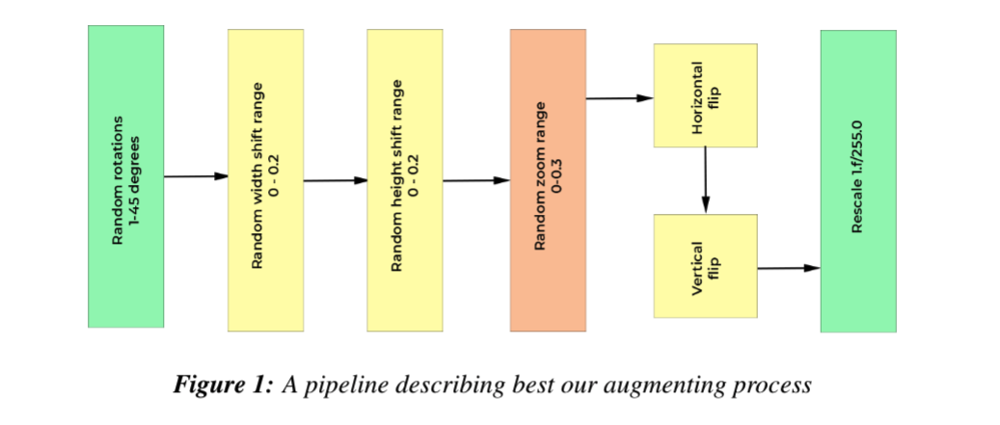
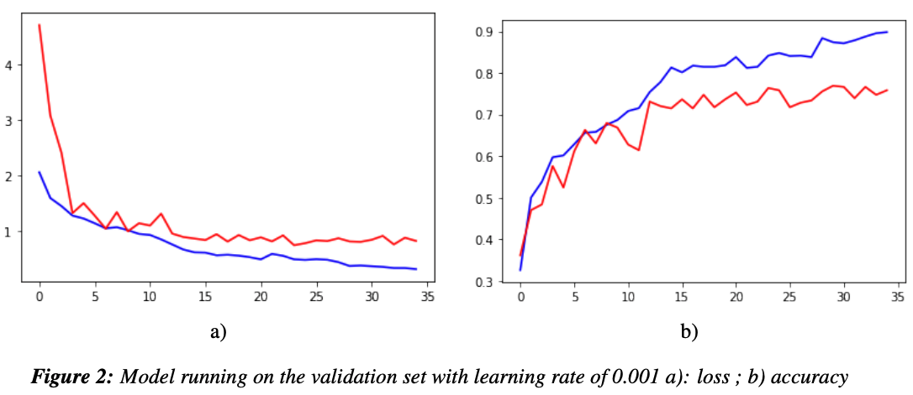
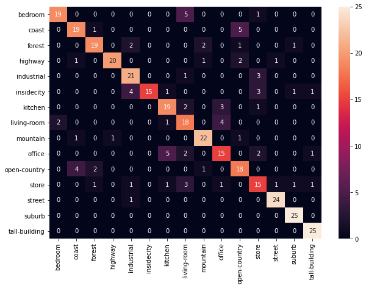

# CIFAR10

In a quest to further improve the accuracy of our models and to ameliorate the effect of small datasets, 
the use of transfer learning become more popular nowadays. In transfer learning, features from a network trained in a “source” task are transferred to a second “target” network with the hope that features learned will help in the new problem. It has been shown that the performance of transferring features 
from source to target decreases more with respect to their dissimilarity

## Preprocessing the images

Preprocessing consisted of splitting the training set into train, valid sets with
`ratio = (.75, .25)` and augmenting the data encouraging the model to learn locations in different perspectives.  During training all images were resized in `output_size = (200, 200)`, preserving the most common aspect ration in the dataset and the labels have been encoded to categorical labels.

After preparing the data, we have created the model. The architecture is based on ResNet152V2 base
layers with the weights pre-trained on the ImageNet corpus. We only fine-tuned the layers on top of the
base, thus encouraging the model to learn unique features from our dataset corpus.

The amount of change of the model during each step, or step size, is called the learning rate and plays
an important role for the neural network in order to achieve good performance. We want to be able to monitor how quickly or slowly our network model learns the problem of classifying locations. At the same time,
we desire the flexibility of reducing the learning rate by a `factor = .4` once learning stagnates; when no
improvement is seen for `patience = 3` number of epochs. Moreover, learning rate monitors the validation
accuracy and prevents the model from further learning in case of overfitting (see Figure 3). The learning
rate used is ReduceLROnPlateau.

## Results

Training the ResNet152V2 model in 35 epochs we achieved during training an accuracy of 0.9068. We evaluated the model on the validation set achieving 0.7853 accuracy.

Looking at the confusion matrix below we can see that pictures that were obvious in context (unambiguous) were correctly classified by our model. However, pictures that were inside buildings were mistaken,
for example: instead of predicting bedroom our model spit out living-room. And that makes sense, because
both locations have really similar features, such as: sofas, lamps, table etc. This is also a consequence of
having a really small training set.

  

